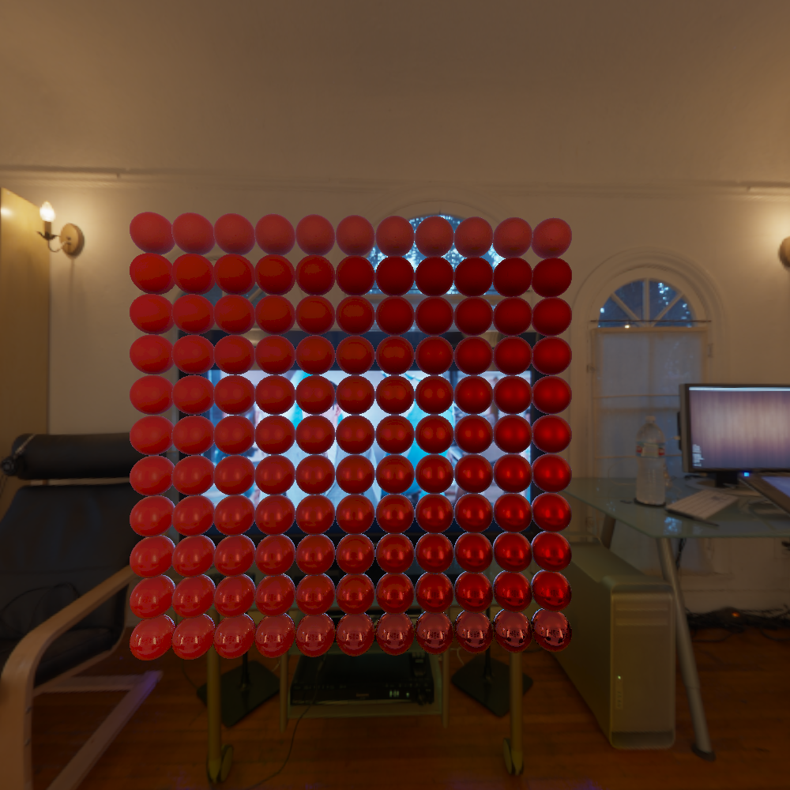
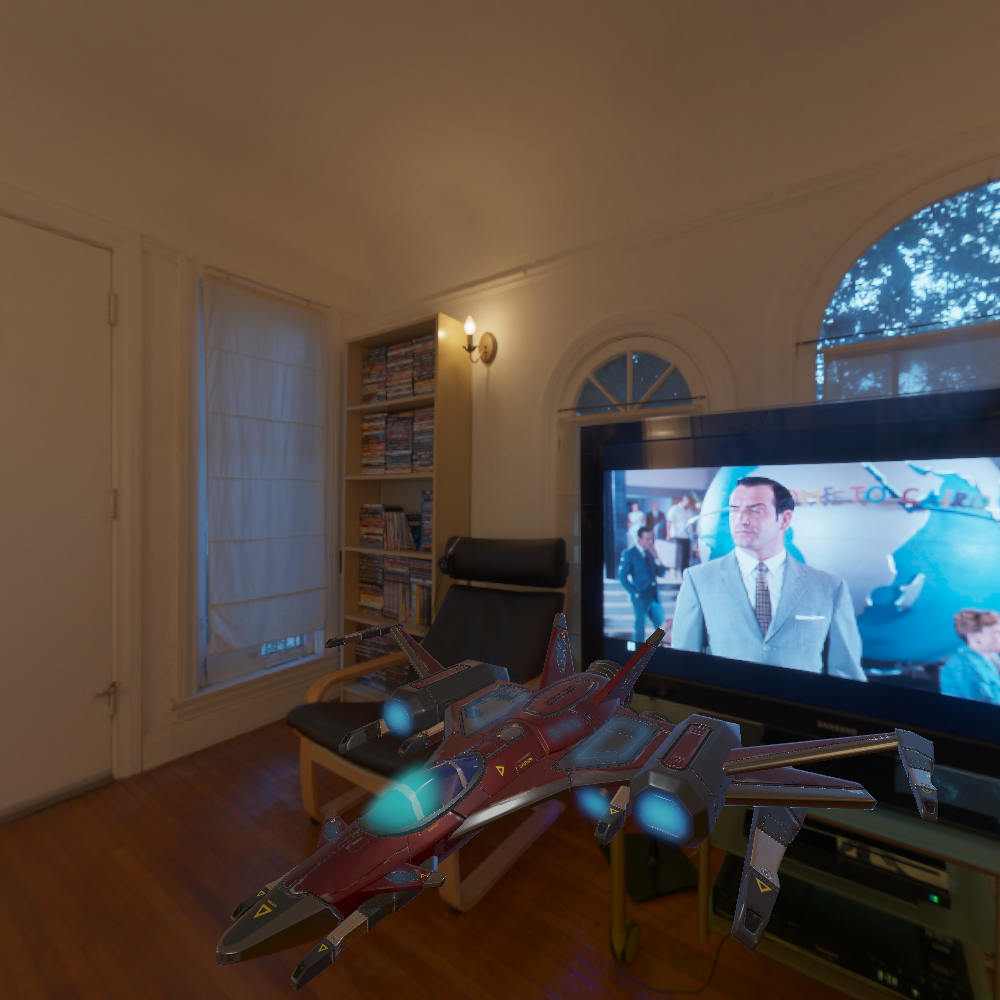

# ti_render

**3d graphic render for study**

## features

- [x] deferred shading

- [x] z pre-pass

- material
    - [x] normal map
    - [x] bump map
    - [x] ao map
    - [x] emissive map

- pbr
    - [x] light
    - [x] diffuse irradiance
    - [x] specular IBL

- shadow
    - [x] point light shadow map

## images

> pbr balls

> a star sparrow
